# Org Scoping in Bifrost

This is the single source of truth for how organization scoping works.

If you are touching code that reads or writes anything with an
`organization_id` column, **read this file before you write code.** The
pattern is mandatory by default; exemptions are explicit.

The companion implementation is `api/src/repositories/org_scoped.py`. The
companion resolver is `api/shared/scope_resolver.py`. The companion lint
tests live under `api/tests/unit/` and fail CI when this pattern is
bypassed.

---

## End-to-end: the five gates a request descends through

Access in Bifrost is not one check; it is a **descent through five gates**,
and every one must pass. "Aligned all the way down" means the caller's org,
the entity's scope, the caller's role, and the row's policy all agree. A
mismatch at any level denies — there is no gate that re-grants what a
higher gate refused.

The chain starts at the **caller**, not at the repository. Work executes
**on behalf of** the caller: the engine is the transport, the caller's
`ExecutionContext` is the authority.

```mermaid
flowchart TD
    A["Caller hits a surface<br/>(form submit · API trigger · agent · scheduled event)"]
    A --> B["GATE 0a — On-behalf-of capture<br/>Handler captures caller identity + scope:<br/>user_id, email, org, is_platform_admin<br/>builds ExecutionContext (+ solution_id if solution-managed)<br/><i>service.py:564 · endpoints.py:201 · auth.py:362</i>"]

    B --> C["GATE 0b — Sentinel transport<br/>Engine dispatches run, authenticates to API<br/>as the FIXED sentinel superuser (SYSTEM_USER_ID).<br/>API trusts the <b>envelope</b> — NOT the authority.<br/>Every SDK call re-derives scope from the<br/>ExecutionContext's caller fields, not the sentinel's.<br/><i>_execution_context.py:set_scope · resolve_scope</i>"]

    C --> D{"GATE 1 — Scope resolution<br/>resolve_effective_scope<br/><i>scope_resolver.py</i>"}
    D -->|"UNSET (field omitted)"| D1["effective_scope = caller_org_id<br/>(always allowed)"]
    D -->|"explicit None / other UUID"| D2{"bypass?<br/>is_platform_admin OR is_provider_org"}
    D2 -->|no| DENY1["ScopeNotAllowed (raise)"]
    D2 -->|yes| D3["effective_scope = None (global) / that UUID"]
    D -->|"caller_org_id"| D1

    D1 --> E
    D3 --> E
    E{"GATE 2 — Entity resolution + cascade<br/>OrgScopedRepository.get / list<br/><i>org_scoped.py</i>"}

    E --> F{"Solution context active?<br/><i>module_cache_sync.get_solution_context</i>"}
    F -->|"yes — solution-managed run"| G["FIRST STOP: resolve under<br/>_solutions/{id}/ (modules) /<br/>solution_id-owned row (entities)<br/><i>own-first; ctx.solution_id / X-Bifrost-App</i>"]
    G --> H{"global_repo_access?<br/>(CODE fallback only —<br/>data fallback is ungated today)<br/><i>Solution.global_repo_access</i>"}
    H -->|"no (code)"| HFINAL["FINAL STOP for code<br/>(no _repo/ module fallthrough —<br/>a bare _repo/ import does NOT resolve)"]
    H -->|yes| I
    F -->|"no — plain _repo/ run"| I["Cascade: org-specific row<br/>then global (solution_id IS NULL world)"]

    HFINAL --> J
    I --> J
    J{"GATE 3 — RBAC / access_level<br/>role-table match: FormRole, AppRole,<br/>AgentRole, WorkflowRole<br/><i>org_scoped.py role filter</i>"}
    J -->|"no matching role<br/>(role_based entity)<br/>or external on authenticated tier"| DENY2["403 / not visible"]
    J -->|"authenticated (non-external) /<br/>everyone / role matches / superuser"| K

    K{"GATE 4 — Table access policies<br/>evaluate_action — OR of rules,<br/>DEFAULT DENY, per row<br/><i>shared/policies/probe.py · CustomClaim</i>"}
    K -->|"no rule grants action"| DENY3["row denied"]
    K -->|"a rule's when matches the row+user"| GRANT["✅ access granted"]
```



**Reading the diagram:** the sentinel (gate 0b) is *how the work travels*;
the caller's `ExecutionContext` (gate 0a) is *whose authority it travels
under*. They are deliberately separate. A leak of the sentinel collapses
only the transport trust — the per-call C2 gate (gate 1) still runs against
the caller's real flags. Solutions are a **first stop at gate 2**. For
**code** resolution they are the **final stop unless `global_repo_access`
is on** (the diamond above). For **data** (tables/configs/storage) the
flag does **not** apply today — data fallback to `_repo/` is currently
ungated; whether it should be gated is an open question (see the Solutions
section). Table policies (gate 4) gate individual *rows* after the *table*
itself has been resolved and RBAC-checked.

### External users live at gate 3 only

`User.is_external` marks portal/guest principals. The flag is neutralized at
token mint for bypass callers (`shared/external_access.py`:
`is_platform_admin OR is_provider_org` → never externally restricted) and
affects EXACTLY ONE thing: the access-level check at gate 3.

- `access_level="authenticated"` is **"Everyone except external users"** —
  it does not grant to an external principal, org-scoped or global.
- `access_level="everyone"` grants to any signed-in user in scope,
  including externals. This is the lever for a provider-built global
  app/form/agent/workflow that external users should reach without
  per-person role grants.
- `role_based` grants an external exactly what it grants anyone holding
  the role — **including on global entities**.
- `private` (agents) stays owner-only.

`is_external` plays **no part in gates 1–2**: scope resolution and the
cascade are org-keyed, never user-keyed. Do not drop the global arm of the
cascade for externals — that breaks explicit role grants on global entities
(the row disappears before the role check can run). The workflow engine is
likewise untouched: the sentinel resolves with the full cascade, and
`ExecutionContext.is_external` is purely informational material a workflow
developer may use to self-filter.

One carve-out family sits OUTSIDE the tiers because those surfaces have no
grant axis at all:

- **Knowledge content** (CLI `/api/cli/knowledge/*`, MCP `search_knowledge`,
  `/api/knowledge-sources/*` reads): externals are 403'd outright; their
  agents/workflows still ground on KB via the engine.
- **Decrypted global secrets** (SDK config `merged_for_sdk(external=True)`
  drops the global tier; the global OAuth token lookup returns None for
  externals; `/api/sdk/integrations/*` is gated): a global third-party
  credential never reaches a direct external caller.

---

## The pattern in one paragraph

Every execution-resolution entity (Config, Table, OAuth, etc.) goes through
`OrgScopedRepository`. There is exactly one cascade primitive (org-specific
OR global), exactly one scope resolver function, exactly two repository
methods (`get` for single-entity resolution, `list` for enumeration).
User-ness is encoded in the repository instance, not the method names.
Identity entities (Organization, User, UserRole, OAuthAccount, AuditLog)
are not org-resolved and bypass this pattern.

---

## Trust model

There are two entry paths into the API:

1. **Engine sentinel → API.** The engine authenticates as a single fixed
   superuser identity (`SYSTEM_USER_ID`). The SDK running inside the
   workflow process reads `context.caller` and resolves scope locally via
   `resolve_effective_scope` before making the API call. The API receives
   the resolved scope and trusts it because the principal is the sentinel.
   **The sentinel credential is the security boundary; if it leaks, this
   isolation model collapses.** That is a known and accepted cost.

2. **User → API directly.** REST endpoints hit by the UI authenticate the
   user. The API applies the same resolver against the authenticated user
   (principal IS caller, no indirection).

MCP does NOT follow this pattern. MCP authenticates as the user directly
and is out of scope for the engine-sentinel model.

---

## The scope-resolution rule

Implemented in `api/shared/scope_resolver.py::resolve_effective_scope`.
Everywhere a caller can target a scope — SDK calls, CLI requests, REST
endpoints, ambient `ExecutionContext.set_scope()` — this exact rule
runs. There is no "almost the same" check elsewhere.

### The three input forms

A caller's intent has three distinct shapes:

| Caller input               | Means                              | Resolver's `requested_scope`          |
| -------------------------- | ---------------------------------- | ------------------------------------- |
| Field omitted (`scope=None` in a Python default, missing in JSON, empty string for CLI compat) | "Use my default org"             | `UNSET` sentinel                      |
| `scope=None` explicit / `scope="global"` | "Operate on global"              | Python `None`                         |
| `scope="<uuid>"`           | "Operate on that org"              | `UUID(...)`                           |

**UNSET and explicit `None` are NOT the same and must not collapse.**
"Didn't specify" defaults to the caller's own org and is always allowed.
"Explicitly asked for global" requires bypass. Collapsing them lets
anyone reach global by simply omitting the field — a recurring bug
class. The resolver uses a distinct `_Unset` sentinel for this exact
reason; one branch returns `caller_org_id`, the other gate-checks.

### The output: `effective_scope`

The resolver returns an `effective_scope` (UUID or None for global) only
after verifying the caller is allowed to ask for it. **You cannot get
an `effective_scope` you weren't authorized for.** Resolution and
authorization are the same step; there is no "resolve first, check
later" — they are inseparable.

For any unauthorized input the resolver raises `ScopeNotAllowed`. It
NEVER silently coerces ("just return caller_org_id as a safe default"
would mask cross-tenant attempts). Callers either get an
`effective_scope` they're entitled to, or an exception. No third path.

### The four rules

| `requested_scope`         | Allowed if...                              | Result (`effective_scope`) |
| ------------------------- | ------------------------------------------ | -------------------------- |
| UNSET                     | always                                     | `caller_org_id`            |
| explicit `None` (global)  | `is_platform_admin OR is_provider_org`     | `None`                     |
| `caller_org_id`           | always                                     | `caller_org_id`            |
| any other UUID            | `is_platform_admin OR is_provider_org`     | that UUID                  |

### Bypass = `is_platform_admin` OR `is_provider_org`

Two independent flags either of which grants scope-bypass:

- `is_platform_admin` — `User.is_superuser=True`. The user can live in
  any org or no org at all.
- `is_provider_org` — `User.organization.is_provider=True`, regardless
  of `is_superuser`. The typical caller archetype is a regular employee
  in the platform-provider org (e.g. a non-admin Covi employee).

They aren't redundant. `is_platform_admin` in a non-provider org is a
real case (a system account assigned to a regular org). A non-admin in
the provider org is also a real case (most platform employees).
Collapsing the flags would either over-grant (every provider-org
member becomes a superuser) or under-grant (regular platform employees
can't operate cross-tenant). Two independent flags, either alone
sufficient — that's the C2 rule.

### Where the rule actually runs

The same resolver runs at four call sites; each sources the caller's
flags from an auth-verified principal:

| Call site                                       | Caller principal source                                   |
| ----------------------------------------------- | --------------------------------------------------------- |
| `_resolve_sdk_org_id` (API-side, `/api/sdk/*`)  | `current_user` from JWT (auth-verified)                   |
| `resolve_scope()` (SDK-side, in workflow proc)  | `ExecutionContext` populated by engine from request       |
| `ExecutionContext.set_scope()` (ambient)        | Same `ExecutionContext` instance                          |
| REST routers using the resolver directly        | `current_user` from JWT                                   |

Under workflow execution the API authenticates the engine sentinel
(`is_superuser=True`), so the API-side check effectively always
passes — the SDK-side `resolve_scope` is the load-bearing gate for
engine-routed calls. For direct user calls (CLI, REST) the API-side
check is the gate.

Every SDK mutator that accepts `scope` must call `resolve_scope(scope)`
locally before posting. The mechanical lint test
(`tests/unit/test_org_scoping_enforcement.py::TestSDKEndpointsUseResolver`)
fails CI for any new handler that ducks this.

---

## The two repository methods

`OrgScopedRepository` exposes exactly two methods. User-ness lives on the
repository instance (`user_id`, `is_superuser`); the methods themselves
have no user-aware variants.

### `repo.get(name=...)` or `repo.get(id=...)`

Resolve one entity. SDK execution path.

- **Name/key lookup**: cascade with override semantic. Try org-specific
  first; fall back to global. Returns at most one row. If an org-specific
  entry exists with the same name as a global one, the org entry wins.
- **ID lookup**: globally unique, no cascade. Returns the entity directly.
  Access checks still apply (superusers bypass; regular users must be in
  scope and pass role check).

### `repo.list()`

Enumerate everything visible. UI execution path.

- Cascade union: returns both org-specific and global entries. Name
  collisions are NOT resolved — both rows are returned. UI shows them
  side-by-side.
- Role filter applies automatically when the repository was constructed
  with a regular user (`user_id` set, `is_superuser=False`). Skipped for
  superusers.

### How the user-ness is encoded

```python
# Direct user endpoint (REST hit by the UI)
repo = TableRepository(
    db,
    org_id=user.org_id,
    user_id=user.id,
    is_superuser=user.is_superuser,
)

# SDK execution endpoint (engine has already resolved scope)
repo = TableRepository(
    db,
    org_id=resolved_scope,
    is_superuser=True,  # the engine sentinel is trusted
)
```

Same `list()` call, different behavior, baked into the instance.

---

## Cascade is centralized; caching is per-repository

Cascade is the cross-cutting concern: every execution-resolution entity
needs org-then-global. It lives in `OrgScopedRepository` as one primitive
used by both `get` and `list`. **No subclass reimplements cascade. No
router writes inline cascade queries.**

Caching is a per-entity concern (only Config caches today; maybe Knowledge
later; most entities don't). When an entity needs caching, it's a thin
transparent layer **inside that repository** wrapping the standard
methods. The cache layer calls the cascade primitive on miss; it does
NOT reimplement cascade. Cache invalidation hooks live on the repository,
not in `core/cache/invalidation.py`.

### How global-config writes invalidate org caches without enumeration

Org-scoped config caches are merged views — a write to a global config
needs to make every org's cached merge stale. Pre-overhaul, this either
(a) didn't happen (orgs served stale fallback until TTL) or (b) was
attempted via `SCAN bifrost:org:*:config` (a hot-path enumeration that
scales O(N) with org count).

The fix is a **version-bumped key**: `bifrost:config:global_version` is
an integer counter. Org-scoped cache keys embed the current version
(`bifrost:org:{uuid}:config:v{N}`). A global config write does one
`INCR` and every org's cache becomes stale by key — no SCAN, no
enumeration. Old keys age out via TTL.

Cascade reader/writer use `core/cache/keys.py::config_hash_key_versioned`
to read the current version. The invalidation hooks live on
`ConfigRepository`, not in `core/cache/invalidation.py`.

---

## Endpoint surfaces

The HTTP API has two surfaces for org-scoped data, with different trust
boundaries. **Both are reachable by directly-authenticated users**; the
`/api/sdk/*` carve-out is a primary call path for the engine but is NOT
exclusive to it.

**`/api/sdk/*` — SDK / CLI surface.** Two callers:

1. **The engine**, executing a workflow. The engine authenticates as the
   sentinel superuser and runs the SDK-side `resolve_scope` first; the
   API receives the already-resolved scope and the resolver's bypass
   triggers because the principal is `is_superuser=True`. The SDK-side
   resolver is the security boundary for this caller.
2. **The user's local CLI** (`bifrost ...`), authenticated as that user
   directly. The API-side `_resolve_sdk_org_id` gate fires against the real
   principal — same `is_platform_admin OR is_provider_org` rule the
   resolver enforces everywhere. The C2 e2e tests
   (`test_org_scoping_scenarios.py`) cover this path explicitly.

The handlers do not differentiate the two callers — every scope-taking
handler routes through `_resolve_sdk_org_id` (the mechanical lint test
asserts this). What differs is which gate ultimately catches an
unauthorized request: SDK-side for engine traffic, API-side for direct
CLI traffic.

**`/api/*` — Direct REST surface.** Called by the UI as the
authenticated user. The endpoints apply `resolve_effective_scope`
against the authenticated principal and pass the user's actual
privileges (`is_superuser=user.is_superuser`) to the repository so
role-based filters fire.

**`/api/cli/download` is a deliberate exception.** It serves the
`pip install` URL for the Bifrost CLI itself and stays at its current
path because the URL IS the install command users type. Served by a
separate `install_router` in `routers/cli.py` so its semantics are
explicit, not a router-prefix carve-out. This is the only path under
`/api/cli/*` that survives the 2026-05 rename.

---

## Entity classification

Twenty-four ORM models carry `organization_id`. The classification is
encoded in the codebase (one-line comment above each model class) and
verified by a mechanical test
(`test_org_scoped_models_have_repository`). Adding a new org-scoped
model without classifying it fails CI.

### Execution-resolution (15) — accessed via `OrgScopedRepository`

| Entity              | Role Table         | Direct User Access | Notes                                          |
| ------------------- | ------------------ | ------------------ | ---------------------------------------------- |
| Form                | `FormRole`         | Yes                | RBAC via roles, has `access_level`             |
| Application         | `AppRole`          | Yes                | RBAC via roles, has `access_level`             |
| Agent               | `AgentRole`        | Yes                | RBAC via roles, has `access_level`             |
| Workflow            | `WorkflowRole`     | No (SDK only)      | RBAC checked at execution start                |
| Table               | None               | No (SDK only)      | Cascade only, no RBAC                          |
| Config              | None               | No (SDK only)      | Cascade only; per-repo cache                   |
| SystemConfig        | None               | Admin-only         | System settings with per-org overrides         |
| KnowledgeStore      | None               | No (SDK only)      | Cascade only, no RBAC                          |
| IntegrationMapping  | None               | No (SDK only)      | Cascade only, no RBAC                          |
| OAuthProvider       | None               | Admin-only         | `OAuthProviderRepository` — cascade + OAuth-domain methods (create/update/delete/store_token/to_detail) |
| OAuthToken          | None               | No (SDK only)      | `OAuthTokenRepository` — cascade + `get_org_level_for_provider` helper. MUST filter by org. |
| MCPServer           | None               | No (SDK only)      | Cascade only                                   |
| MCPConnection       | None               | No (SDK only)      | Cascade only                                   |
| EventSource         | None               | Admin-only         | Resolved when event arrives to find trigger    |
| CustomClaim         | None               | Admin-only         | Resolved during table policy evaluation         |

### Identity (9) — NOT org-resolved, NOT subject to cascade

| Entity                 | Why exempt                                                                  |
| ---------------------- | --------------------------------------------------------------------------- |
| Execution              | Execution telemetry; not resolved by name with cascade                      |
| ExecutionMetricsDaily  | Aggregated execution telemetry                                              |
| WorkflowROIDaily       | Aggregated ROI telemetry                                                    |
| KnowledgeStorageDaily  | Aggregated storage telemetry                                                |
| User                   | Identity record; looked up by ID for auth/audit, not by name with cascade   |
| AIUsage                | AI cost/usage telemetry                                                     |
| KnowledgeNamespaceRole | RBAC junction; consumed by KnowledgeRepository, not resolved as an entity   |
| Event                  | Event record post-receipt (telemetry)                                       |
| AuditLog               | Write-only from execution path; no cascade lookup ever                      |

Three additional entities are identity but do NOT carry an
`organization_id` column themselves: `Organization` (it IS the org),
`UserRole` (junction to users), `OAuthAccount` (joins to users via
SSO flows). They are included here for completeness but are not part
of the `organization_id`-bearing count.

---

## `access_level` semantics

For entities that have it:

- `'authenticated'` — Any user who can cascade to this scope can access.
- `'role_based'` — User must have a matching role in the entity's role
  table.
- `'private'` — Owner only (checks `owner_user_id`).
- Entities without role tables don't have `access_level`.

---

## Solutions: first-stop resolution and the global-repo-access gate

A **Solution** is an installable bundle of workflows, apps, tables, configs,
forms, and agents. Its entities live in a parallel namespace keyed by
`solution_id`, and its code lives under `_solutions/{solution_id}/` in S3.
A Solution inserts itself at **gate 2 (entity resolution)** as a **first
stop**, and is the **final stop unless the install's `global_repo_access`
flag is on**.

There are two parallel mechanisms — same rule, different layer:

### 1. Module loads (the code side)

`api/src/core/module_cache_sync.py` resolves a workflow's own code and its
`from modules.x import y` imports. When a solution context is active:

- Try `_solutions/{solution_id}/…` **FIRST**.
- Fall through to the bare `_repo/` root **ONLY when `global_repo_access`
  is on**. With it off, a bare `_repo/` import does **not** silently
  resolve — the solution is sealed **for code**.

`global_repo_access` governs **code only**. See the open question at the end
of this section for why data (gate 2's entity reads) is currently ungated.

The context is per-execution and thread-local: `set_solution_context` /
`clear_solution_context` / `get_solution_context`. No active context ==
unchanged plain `_repo/` behavior, so non-solution runs are unaffected.

### 2. Entity reads (the data side)

`OrgScopedRepository` (`org_scoped.py`) treats solution-managed rows
(`solution_id IS NOT NULL`) as a **separate world resolved by id**, not by
the name cascade:

- The name/path cascade (gate 2's `get(name=...)`) restricts to
  `solution_id IS NULL` — the `_repo/` tier — so a `_repo/` name and a
  solution name **never collide** into `MultipleResultsFound`. This is
  what lets a `_repo/` table and a solution-managed table share a name in
  the same org (see migration `20260606_table_name_solution_scope`).
- A solution's *own* entities are resolved **own-first** by `solution_id`.
  The install id reaches the resolver from one of two client-supplied
  sources, both **gated to the caller's org scope** so a foreign install
  id can't reach another org's row:
  - A solution **workflow** carries `ctx.solution_id`; the SDK appends
    `?solution=` to name lookups (`ExecutionContext.solution_id`,
    `_execution_context.py`).
  - A solution **app** sends `X-Bifrost-App`; the router maps it to
    `Application.solution_id` (`_resolve_solution_table_by_name` in
    `routers/tables.py`).

### How the context is plumbed

The install's `global_repo_access` flag is read once at dispatch in
`jobs/consumers/workflow_execution.py` (from `Solution.global_repo_access`),
passed to the worker as `solution_global_repo_access`, and applied via
`set_solution_context` in `services/execution/worker.py` /
`simple_worker.py`. It is cleared after the run.

### Uninstall and orphaning

When a Solution is uninstalled non-destructively, its data rows survive
with `solution_id` NULL'd and `orphaned_at` set. The cascade excludes
orphaned rows from name resolution (independently of `solution_id`, since
`Config` would otherwise miss the exclusion) — the former-install data
stops resolving by name but is not deleted.

### Open question: should data fallback be gated?

`global_repo_access` gates **code** fallback (the module loader). **Data
fallback is currently ungated**: a solution-managed run reads a `_repo/`
table or config by name regardless of the flag. This is an asymmetry — a
"sealed" install can't import `_repo/` code but *can* read `_repo/` data.

Whether to close it is undecided. Options under consideration: reuse
`global_repo_access` for data too (one "touch `_repo/` at all" flag), add a
separate data-fallback flag (independent code/data sharing), or leave data
ungated. See
`docs/superpowers/specs/2026-06-08-solution-workflow-resolution-chokepoint-design.md`.
Until that resolves, the current behavior — **code gated, data ungated** —
is the truth.

---

## Table access policies (gate 4)

Beneath cascade and RBAC sits a **per-row** gate: table access policies.
Gates 1–3 resolve *which table* you get and whether you may touch it at
all; gate 4 decides *which rows* within it.

- Evaluated by `shared/policies/probe.py::evaluate_action`: **OR across all
  rules whose `actions` includes the attempted action; default DENY** if no
  rule grants it. A rule with `when is None` grants unconditionally.
- A rule's `when` is a claim expression evaluated against `(row, user)`.
  `CustomClaim` entities (an admin-only, org-scoped execution-resolution
  entity) supply named claims; the `has_role` evaluator reads the user's
  resolved roles (populated on the auth principal, Redis-backed per-user
  role cache — see `routers/roles.py`).
- Reads compile to SQL (`compile_read_filter`) so row filtering happens in
  the query, not in Python. Websocket subscribe uses `is_subscribe_authorized`
  (conservatively allows row-data-dependent policies). Mutations evaluate
  `evaluate_action` against the concrete row.

Because gate 4 is default-deny, a table with **no** policies grants no row
access through the policy path — callers reach rows only via paths that
seed an admin bypass or an explicit grant. Policy claim references are
validated against the org's known claims at write time
(`_validate_table_policy_claim_refs`).

---

## Creating a repository

For an entity with RBAC:

```python
from src.repositories import OrgScopedRepository
from src.models.orm import MyEntity, MyEntityRole

class MyEntityRepository(OrgScopedRepository[MyEntity]):
    model = MyEntity
    role_table = MyEntityRole
    role_entity_id_column = "entity_id"
```

For an entity without RBAC:

```python
class MyEntityRepository(OrgScopedRepository[MyEntity]):
    model = MyEntity
    # No role_table — cascade only
```

That's it. The base class provides `get` and `list`. The cascade primitive
is already correct. Do not override these methods unless you're adding
caching, and even then call into the base via `super()` rather than
reimplementing.

---

## Usage examples

### Direct user access (REST endpoint hit by the UI)

```python
@router.get("/{slug}")
async def get_application(slug: str, ctx: Context, user: CurrentUser):
    repo = ApplicationRepository(
        ctx.db,
        org_id=ctx.org_id,
        user_id=ctx.user.user_id,
        is_superuser=ctx.user.is_superuser,
    )
    return await repo.can_access(slug=slug)
```

### Workflow execution authorization (use workflow's org, not caller's)

```python
workflow_repo = WorkflowRepository(
    session=db,
    org_id=workflow.organization_id,
    user_id=ctx.user.user_id,
    is_superuser=ctx.user.is_superuser,
)
await workflow_repo.can_access(id=workflow_id)
```

### SDK data access (engine has already resolved scope)

```python
# Engine sentinel is trusted; pass the resolved scope through.
repo = TableRepository(
    session=db,
    org_id=execution_org_id,
    is_superuser=True,
)
table = await repo.get(name=table_name)
```

---

## When NOT to use this pattern

Some endpoints don't touch execution-resolution entities and are exempt.
The exemption is explicit (allow-list entry in
`test_sdk_endpoints_use_resolver`) with a one-line justification per
endpoint. Categories:

- **Auth and session.** Login, token refresh, whoami, dev context.
  The caller's identity is the input; no org parameter.
- **Health, version, capabilities.** Pings, OpenAPI spec, CLI download.
- **Cross-org platform admin operations.** Listing all orgs, creating an
  org, user provisioning. These intentionally span orgs and have their
  own platform-admin guard at the endpoint level.
- **Execution-scoped telemetry.** Fetching logs/results for a specific
  `execution_id`. The execution itself carries its scope; the endpoint
  needs `is_caller_allowed_to_see_this_execution`, not scope cascade.

If you're adding a new endpoint and it fits one of these categories,
document why in the endpoint's docstring AND add the allow-list entry.
If it doesn't fit, use the pattern.

---

## Common mistakes

- **Inline cascade queries in router files.** `WHERE organization_id ==
  org_id OR organization_id IS NULL` written by hand in a handler. Use
  the repository. The lint test catches this on PR.
- **Trusting `requested_scope` directly.** Passing whatever the request
  body contained as `org_id` to the repository without going through
  `resolve_effective_scope`. This was the `_resolve_sdk_org_id` bug class.
- **Using `BaseRepository` for org-scoped entities.** Always use
  `OrgScopedRepository`. The lint test catches missing repositories on
  models with `organization_id`.
- **Collapsing UNSET and explicit `None`.** They have different security
  semantics. Only platform admins can request global; everyone can omit
  the scope field.
- **Using `ctx.org_id` for workflow execution authorization.** Use the
  workflow's `organization_id`, not the caller's. The workflow's scope
  is the relevant authority during execution.
- **Forgetting cascade affects superusers too.** For name lookups,
  cascade determines which entity is returned, even for superusers.
  A superuser asking for "users" in org A gets org A's `users` table,
  not the global one.
- **Reimplementing cascade in a subclass.** The base class is the only
  place the cascade primitive (`or_(org_id == X, org_id.is_(None))`)
  appears. If you find yourself writing it again, stop.
- **Adding cache invalidation logic to `core/cache/invalidation.py` for a
  specific entity.** Cache invalidation hooks live on the repository
  that owns the cache.

---

## Mechanical enforcement

Three tests ensure this pattern doesn't drift again:

1. `test_no_inline_org_scoping_in_routers` — AST-walks
   `api/src/routers/` and fails if any file contains a raw
   `organization_id ==` comparison or `organization_id.is_(None)`
   outside whitelisted lines.
2. `test_org_scoped_models_have_repository` — for every ORM model with
   an `organization_id` column, asserts there is a corresponding
   `OrgScopedRepository` subclass or the model is on the explicit
   identity-entity allow-list.
3. `test_sdk_endpoints_use_resolver` — for every endpoint that declares
   a `scope` parameter, asserts the handler calls
   `resolve_effective_scope`. Allow-list with per-entry justification
   for exempt endpoints.

Allow-list entries require a one-line comment. Adding one is visible
in code review.

---

## Historical context

Services that have been absorbed into this pattern:

- `api/src/services/authorization.py` — `AuthorizationService`
- `api/src/services/execution_auth.py` — `ExecutionAuthService`

The goal of the 2026-05 consolidation was to make org scoping in Bifrost
stop drifting. See `docs/plans/2026-05-26-org-scoping-consolidation.md`
and the companion audits under `docs/audits/`.
